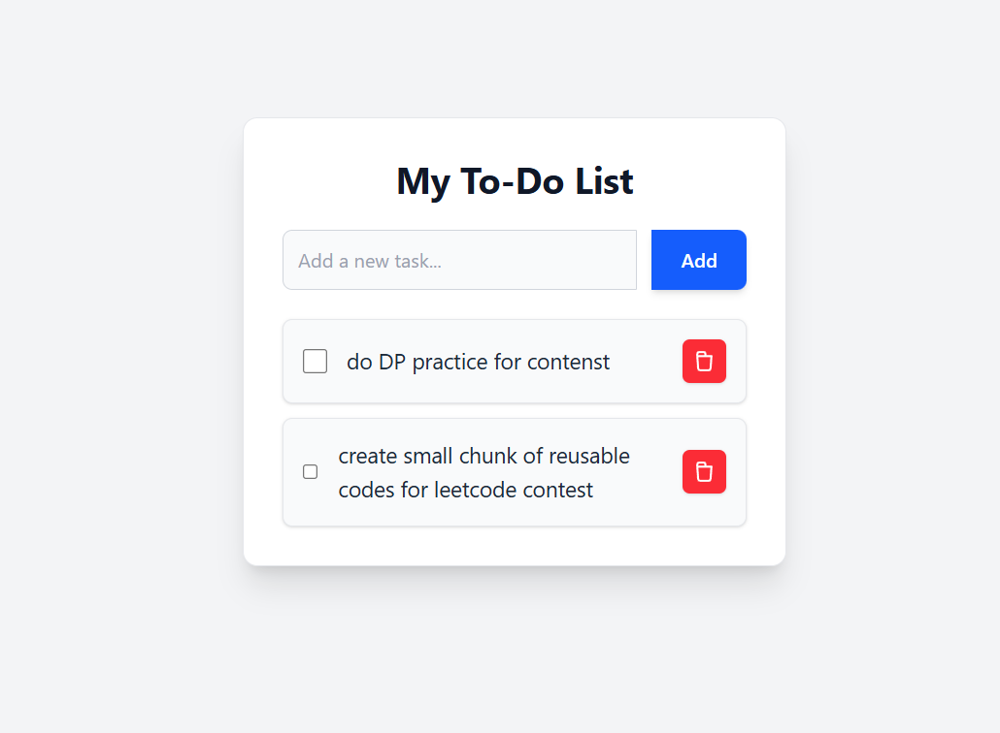

✅ My To-Do List Application
A responsive and user-friendly To-Do List application built with React and styled using Tailwind CSS. This application allows users to effectively manage their tasks, with all data persistently stored in the browser's local storage.

🌟 Project Overview
This To-Do List provides a straightforward interface for task management. It's designed to be intuitive and visually appealing, adapting seamlessly across various devices. The primary focus is on simplicity and reliability, ensuring your tasks are always available where you left them in your browser.

📸 Screenshots
Here's a visual overview of the To-Do List application:

✨ Features
Add Tasks: Quickly add new tasks to your list.
Mark as Complete: Toggle tasks as completed or incomplete to track your progress.
Delete Tasks: Remove tasks that are no longer needed.
Local Storage Persistence: All tasks are saved directly in your browser's local storage, ensuring your data is preserved even after closing and reopening the browser tab.
Responsive UI: Crafted with Tailwind CSS to ensure a consistent and optimized experience on desktops, tablets, and mobile devices.
Confirmation Modals: Provides a user-friendly confirmation dialog before deleting tasks.

🚀 Technologies Used
React: A declarative, component-based JavaScript library for building dynamic user interfaces.
Tailwind CSS: A highly customizable, utility-first CSS framework that enables rapid UI development directly in your markup.
JavaScript (ES6+): The core programming language for application logic.
HTML5 & CSS3: For structuring and styling the web content.

📦 Setup and Installation

npm install
npm run dev
